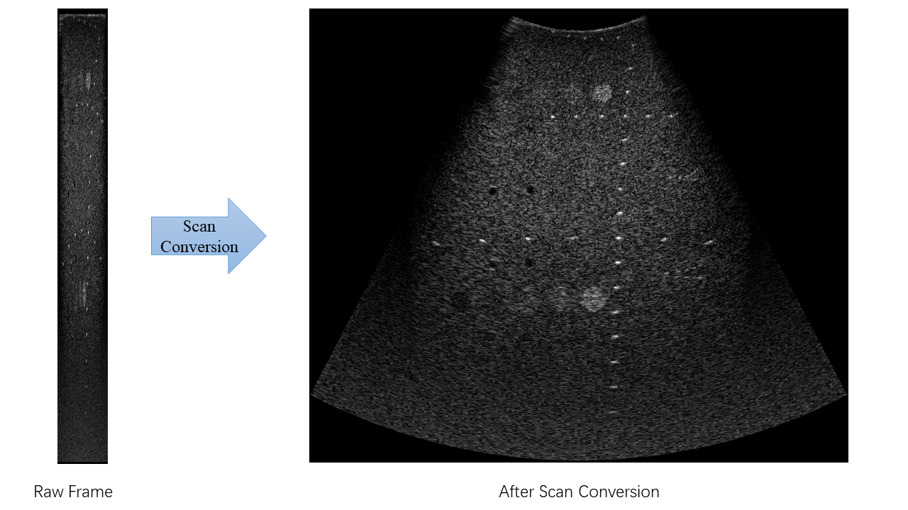
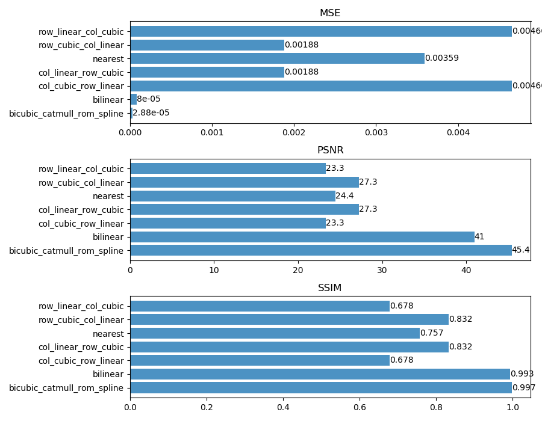
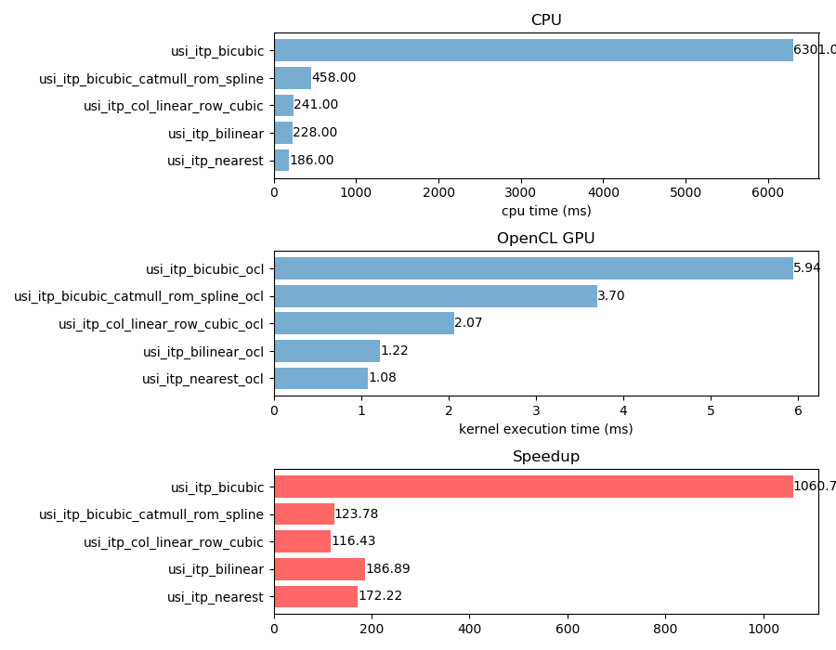

# Ultrasound Scan Conversion Using OpenCL

This is the course project of Parallel Computing, Spring 2018 at SCU. It uses OpenCL to accelerate the scan conversion of ultrasound frames.

Scan conversion is necessary to convert from the polar coordinates associated with the ultrasound data to the Cartesian coordinates used by standard video monitors, as is shown below.



**Table of Contents**

<!-- TOC -->

- [Features](#features)
- [Benchmarks](#benchmarks)
    - [Comparison of different interpolation methods (CPU version, compared to bicubic)](#comparison-of-different-interpolation-methods-cpu-version-compared-to-bicubic)
    - [Speedup (cpu_time / kernel_time)](#speedup-cpu_time--kernel_time)
- [Prerequisites](#prerequisites)
- [Building](#building)
    - [Build Options](#build-options)
    - [Build Types](#build-types)
    - [On Unix-like systems](#on-unix-like-systems)
    - [On Windows](#on-windows)
- [Usage](#usage)
- [Evaluation and Benchmarking](#evaluation-and-benchmarking)
- [Built with](#built-with)
- [License](#license)

<!-- /TOC -->

## Features

- Cross platform:

  - Windows

  - Linux

  - macOS (not tested)

- OpenCL acceleration (Optional)

- Multiple interpolation algorithms:

  - Nearest

  - Bilinear

  - Cubic for row and linear for column

  - Catmul-Rom Spline

  - Bicubic

## Benchmarks

### Comparison of different interpolation methods (CPU version, compared to bicubic)



### Speedup (cpu_time / kernel_time)



## Prerequisites

- OpenCL 2.0 (optional)

- CMake (for building)

- A C compiler supporting the `timespec_get` function of C11

- Python 3 with the following packages (for benchmarking):

  - matplotlib
  
  - numpy

  - scikit-image

## Building

`git clone` this repository, and `cd` to the directory to run build commands.

### Build Options

The following options are defined in `config.h.in`, and can be turned on/off with `cmake -D OPTION=ON|OFF`. CMake will generate `config.h` according to command line options, which will be included by the source files as a configuration file.

Options|Default|Description
-------|-------|-----------
`NDEBUG`|ON|Disable `DBG_PRINT` and `assert`
`TIMING`|ON|Enable timing
`USE_OPENCL`|ON|Use OpenCL

### Build Types

By default, the `Release` version will be built. To build the `Debug` version, pass `-D CMAKE_BUILD_TYPE=Debug` to CMake when generating a build system.

On Windows, when generating a Visual Studio solution, the build type is not controlled by CMake. Instead, it is set in build options of MSBuild or Visual Studio. For command line users, please use CMake in build tool mode as is shown below.

### On Unix-like systems

To build with the default configurations, run the following commands:

```sh
mkdir -p build/linux/release
cd build/linux/release
cmake ../../..
make
```

The executable `scanconv` will be generated under "`build/linux/release`".

### On Windows

For example, to build the `Debug` version, run the following commands:

```bat
mkdir build\windows\debug
cd build\windows\debug
cmake -D CMAKE_BUILD_TYPE=Debug ..\..\..
cmake --build . --config Debug
```

The executable `scanconv` will be generated under "`build\windows\debug\Debug`".

## Usage

Synopsis:

    ./scanconv <dat_file>

For example:

```console
$ ./scanconv image.dat
$
```

Then `raw.png` and `interpolated.png` will be generated under the working directory. `raw.png` is the raw image decoded from `image.dat`, and `interpolated.png` is the interpolated version.

## Evaluation and Benchmarking

`cd` to the building output directory, and

- run `python3 evaluate_cpu.py` to evaluate different interpolation methods (CPU version, compared to bicubic);

- run `python3 profile.py` to see the speedup of OpenCL over CPU.

## Built with

- [stb_image_write.h](https://github.com/nothings/stb/blob/master/stb_image_write.h): image writing to disk (png)

## License

Licensed under the [MIT](LICENSE) License.